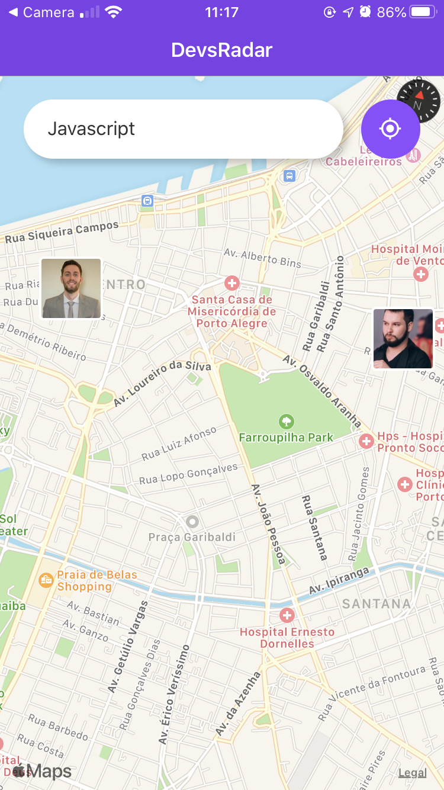
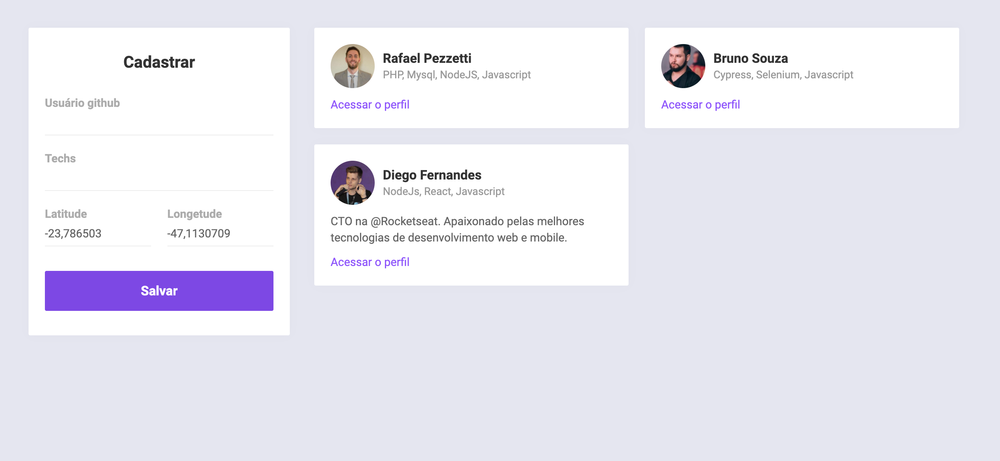

# Dev Radar

Find nearby developers for their specific technologies

## :rocket: Technologies

This project uses :

- [Node.js](https://nodejs.org/en/)
- [React](https://reactjs.org)
- [React Native](https://facebook.github.io/react-native/)
- [Expo](https://expo.io/)

<p align="center">
  
  
</p>


## Installation guide with Docker
To run frontend and backend API just run in root folder
```bash
$ docker-compose up -d
```

To run mobile project you need to use [Expo](https://expo.io/)

```bash
npm i expo-cli -g 
cd mobile
npm i
npm start
``` 
## Running the app

API -> http://localhost:3333

Frontend -> http://localhost:3000

Mobile -> http://localhost:19002
